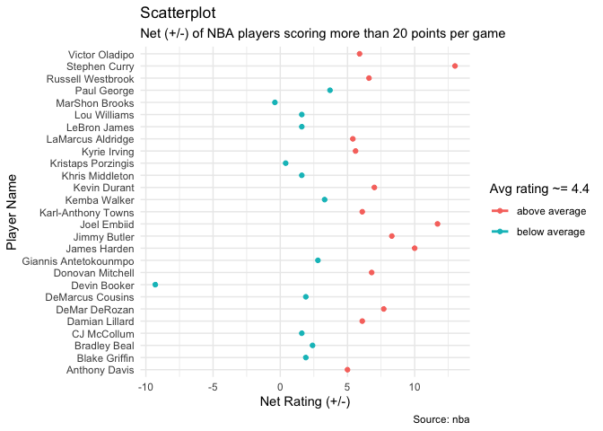

``` r
## loading R packages.
library(pacman)
pacman::p_load(ggplot2, here, readr, dplyr, Stat2Data)
```

### Figure 1: Scatterplot of Points and Age

Load/read in the data.

``` r
nba <- read_csv("../data/nba_players.csv")
```
``` r
head(nba)
```

    ## # A tibble: 6 x 22
    ##      X1 player_name  team_abbreviati…   age player_height player_weight college 
    ##   <dbl> <chr>        <chr>            <dbl>         <dbl>         <dbl> <chr>   
    ## 1     0 Dennis Rodm… CHI                 36          198.          99.8 Southea…
    ## 2     1 Dwayne Schi… LAC                 28          216.         118.  Florida 
    ## 3     2 Earl Cureton TOR                 39          206.          95.3 Detroit…
    ## 4     3 Ed O'Bannon  DAL                 24          203.         101.  UCLA    
    ## 5     4 Ed Pinckney  MIA                 34          206.         109.  Villano…
    ## 6     5 Eddie Johns… HOU                 38          201.          97.5 Illinois
    ## # … with 15 more variables: country <chr>, draft_year <chr>, draft_round <chr>,
    ## #   draft_number <chr>, gp <dbl>, pts <dbl>, reb <dbl>, ast <dbl>,
    ## #   net_rating <dbl>, oreb_pct <dbl>, dreb_pct <dbl>, usg_pct <dbl>,
    ## #   ts_pct <dbl>, ast_pct <dbl>, season <chr>

This is dataset is exported from
[Kaggle](https://www.kaggle.com/justinas/nba-players-data) and contain
biometric, biographic and basic box score features of NBA players from
1996 to 2019. It has \~10k rows.

``` r
# Plot code here
options(scipen=999)  # turn-off scientific notation
library(ggplot2)
theme_set(theme_bw())
gg <- ggplot(nba, aes(x=age, y=pts)) + 
  geom_smooth(method="loess", se=F) + 
  scale_y_continuous(breaks=seq(2,10,0.25)) + 
  scale_x_continuous(breaks=seq(10,50,1)) + 
  labs(subtitle="Points Scored at Given Age", 
       y="Points per Game", 
       x="Age of NBA Player", 
       title="Scatterplot", 
       caption = "Source: nba")
plot(gg)
```

    ## `geom_smooth()` using formula 'y ~ x'

<!-- -->

This is a plot of age on the x-axis and points scored per game (ppg) on
the y-axis. You can see that players, on average, approximately peak at
28 years of age with 9.25 ppg.

### Figure 2: +/- Analysis

``` r
# Plot code here
s2017 = nba[nba$season=='2017-18',]
s2017 = s2017[s2017$pts>20,]
avg = mean(s2017$net_rating)
print(avg)
```

    ## [1] 4.381481

``` r
theme_set(theme_minimal())
ggplot(s2017, aes(x=net_rating, y=player_name, col = ifelse(net_rating > avg,'above average','below average'))) +
  geom_point() + 
  geom_smooth(method=lm, se=FALSE) +
  theme(legend.position="right") + 
  labs(subtitle="Net (+/-) of NBA players scoring more than 20 points per game", 
       y="Player Name", 
       x="Net Rating (+/-)",
       col="Avg rating ~= 4.4",
       title="Scatterplot", 
       caption = "Source: nba")
```

    ## `geom_smooth()` using formula 'y ~ x'


<!-- -->

I created a sample of the data called s2017. This sample only contains
data from the 2017-18 NBA season and players who scored more than 20
points. Then, I took the average of the Plus Minus Statistics (+/-) and
plotted the players with a color code based on whether they fell below
or above this average which came out to +4.381481. You can see that
Stephen Curry, Joel Embiid, and James Harden lead the pack of players
with a high (+/-), wile Devin Booker has the lowest (+/-) by far with
nearly -10.

Plus/Minus (+/-) reflects how the team did while that player is on the
court. If a player has a +5 PM, it means his team outscored the opponent
by 5 points while he was on the court. If he has a -3, then the opposing
team outscored his team by 3 points while he was on the court.
