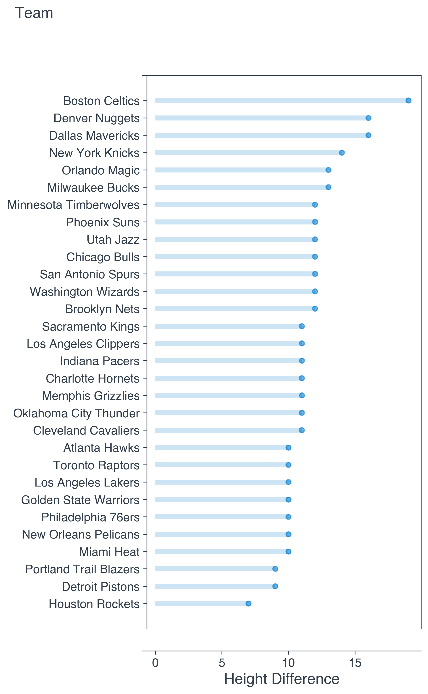

# Histogram of Height Differences Between NBA Players by Team

 

# Motivation
---

This is a goofy proof-of-concept that I can use [Sportsipy](https://sportsipy.readthedocs.io/en/stable/) to pull sports data. Sportsipy is a "free python API that pulls the stats from www.sports-reference.com and allows them to be easily be used in python-based applications". This is perfect for me because most sports data APIs out there are too expensive and hard to use. With Sportsipy I can easily pull data directly into my python3 files like such.
<pre>
from sportsipy.nba.teams import Teams
for team in Teams():
    print("Name: {0} | Abbreviation: {1}".format(team.name, team.abbreviation))
</pre>
<pre>
Name: Los Angeles Clippers | Abbreviation: LAC
Name: Brooklyn Nets | Abbreviation: BRK
Name: Milwaukee Bucks | Abbreviation: MIL
Name: Utah Jazz | Abbreviation: UTA
Name: Atlanta Hawks | Abbreviation: ATL
Name: Denver Nuggets | Abbreviation: DEN
Name: Boston Celtics | Abbreviation: BOS
Name: New Orleans Pelicans | Abbreviation: NOP
Name: Sacramento Kings | Abbreviation: SAC
Name: Philadelphia 76ers | Abbreviation: PHI
Name: Portland Trail Blazers | Abbreviation: POR
...
</pre>
 

# Implementation
---

    <strong>Step 1:</strong> Set up some simple unit conversions:

<pre>
def get_height_in_inches(height):
    feet, inches = height.split('-')
    return int(feet) * 12 + int(inches)

def get_height_in_feet(height):
    feet = height - (height % 1)
    inches = 12 * (height % 1)
    return int(feet) * 12 + int(inches)
</pre>

    <strong>Step 2:</strong> Find differences & display raw output:

<pre>
def print_players(team_heights):
    tallest_player = max(team_heights, key=team_heights.get)
    shortest_player = min(team_heights, key=team_heights.get)
    tallest_height = team_heights[tallest_player]
    shortest_height = team_heights[shortest_player]
    tallest_feet = get_height_in_feet(tallest_height)[0]
    tallest_inches = get_height_in_feet(tallest_height)[1]
    shortest_feet = get_height_in_feet(shortest_height)[0]
    shortest_inches = get_height_in_feet(shortest_height)[1]
    difference = tallest_height - shortest_height
    print('%s: %s\'%s\" & %s: %s\'%s\" for a difference of: %s in.' % (tallest_player, tallest_feet, tallest_inches, shortest_player, shortest_feet, shortest_inches, difference))
    return(tallest_player, shortest_player, tallest_feet, tallest_inches, shortest_feet, shortest_inches, difference)

def display_data():
    master_list = []
    for team in Teams():
        print('=' * 80)
        print(team.name)
        team_heights = {}
        for player in team.roster.players:
            height = get_height_in_inches(player.height)
            team_heights[player.name] = height
        height_diff = print_players(team_heights)
        master_list.append([team.name, height_diff])
    print(master_list)
    return master_list
</pre>

    <strong>Step 3:</strong> Display graph:

<pre>
<em> This just an except of the source code </em>

print(difference_list)
percentages = pd.Series(difference_list, 
                        index=index_list)
df = pd.DataFrame({'percentage' : percentages})
df = df.sort_values(by='percentage')

# set labels
ax.set_xlabel('Height Difference', fontsize=15, fontweight='black', color = '#333F4B')
ax.set_ylabel('')

# set axis
ax.tick_params(axis='both', which='major', labelsize=12)
plt.yticks(my_range, df.index)

# add an horizonal label for the y axis 
fig.text(-0.23, 0.96, 'Team', fontsize=15, fontweight='black', color = '#333F4B')

# set the spines position
ax.spines['bottom'].set_position(('axes', -0.04))
ax.spines['left'].set_position(('axes', 0.015))

plt.savefig('hist2.png', dpi=300, bbox_inches='tight')
</pre>

 

# Raw Print Statement from the Console
--------------------------------
<code>
Brooklyn Nets 
DeAndre Jordan: 6'11" & Chris Chiozza: 5'11" for a difference of: 12 in.
 --- 
Los Angeles Clippers 
Ivica Zubac: 7'0" & Lou Williams: 6'1" for a difference of: 11 in.
 --- 
Milwaukee Bucks 
Brook Lopez: 7'0" & D.J. Augustin: 5'11" for a difference of: 13 in.
 --- 
Utah Jazz 
Rudy Gobert: 7'0" & Donovan Mitchell: 6'0" for a difference of: 12 in.
 --- 
Philadelphia 76ers 
Joel Embiid: 7'0" & Tyrese Maxey: 6'2" for a difference of: 10 in.
 --- 
Golden State Warriors 
James Wiseman: 7'0" & Nico Mannion: 6'2" for a difference of: 10 in.
 --- 
Los Angeles Lakers 
Marc Gasol: 6'11" & Quinn Cook: 6'1" for a difference of: 10 in.
 --- 
Dallas Mavericks 
Boban Marjanović: 7'4" & Trey Burke: 6'0" for a difference of: 16 in.
 --- 
Indiana Pacers 
Domantas Sabonis: 6'11" & Aaron Holiday: 6'0" for a difference of: 11 in.
 --- 
Charlotte Hornets 
Nick Richards: 7'0" & Terry Rozier: 6'1" for a difference of: 11 in.
 --- 
Toronto Raptors 
Aron Baynes: 6'10" & Kyle Lowry: 6'0" for a difference of: 10 in.
 --- 
Sacramento Kings 
Hassan Whiteside: 7'0" & Kyle Guy: 6'1" for a difference of: 11 in.
 --- 
Atlanta Hawks 
Clint Capela: 6'10" & Brandon Goodwin: 6'0" for a difference of: 10 in.
 --- 
New York Knicks 
Mitchell Robinson: 7'0" & Jared Harper: 5'10" for a difference of: 14 in.
 --- 
Cleveland Cavaliers 
JaVale McGee: 7'0" & Collin Sexton: 6'1" for a difference of: 11 in.
 --- 
Denver Nuggets 
Bol Bol: 7'2" & Facundo Campazzo: 5'10" for a difference of: 16 in.
 --- 
Portland Trail Blazers 
Harry Giles: 6'11" & Damian Lillard: 6'2" for a difference of: 9 in.
 --- 
San Antonio Spurs 
Jakob Poeltl: 7'1" & Patty Mills: 6'1" for a difference of: 12 in.
 --- 
Chicago Bulls 
Luke Kornet: 7'2" & Devon Dotson: 6'2" for a difference of: 12 in.
 --- 
Houston Rockets 
DeMarcus Cousins: 6'10" & Eric Gordon: 6'3" for a difference of: 7 in.
 --- 
New Orleans Pelicans 
Steven Adams: 6'11" & Eric Bledsoe: 6'1" for a difference of: 10 in.
 --- 
Detroit Pistons 
Mason Plumlee: 6'11" & Saben Lee: 6'2" for a difference of: 9 in.
 --- 
Orlando Magic 
Mo Bamba: 7'0" & Frank Mason III: 5'11" for a difference of: 13 in.
 --- 
Minnesota Timberwolves 
Karl-Anthony Towns: 6'11" & Jordan McLaughlin: 5'11" for a difference of: 12 in.
 --- 
Phoenix Suns 
Frank Kaminsky: 7'0" & Chris Paul: 6'0" for a difference of: 12 in.
 --- 
Miami Heat 
Meyers Leonard: 7'0" & Kendrick Nunn: 6'2" for a difference of: 10 in.
 --- 
Boston Celtics 
Tacko Fall: 7'5" & Tremont Waters: 5'10" for a difference of: 19 in.
 --- 
Washington Wizards 
Robin Lopez: 7'0" & Ish Smith: 6'0" for a difference of: 12 in.
 --- 
Oklahoma City Thunder 
Moses Brown: 7'2" & Luguentz Dort: 6'3" for a difference of: 11 in.
 --- 
Memphis Grizzlies 
Jonas Valančiūnas: 6'11" & Tyus Jones: 6'0" for a difference of: 11 in.
</code>