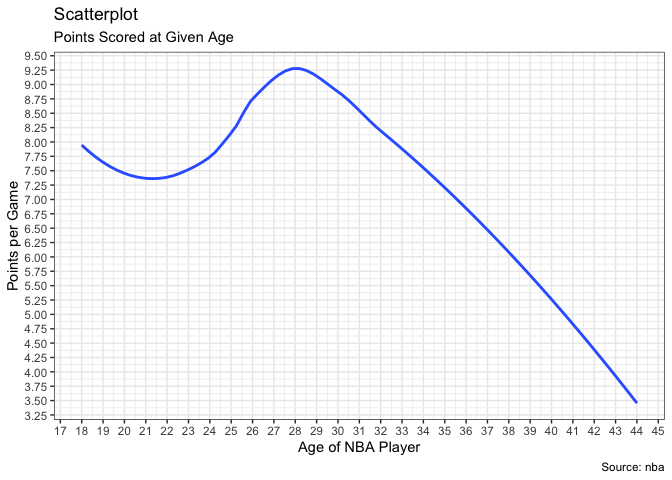
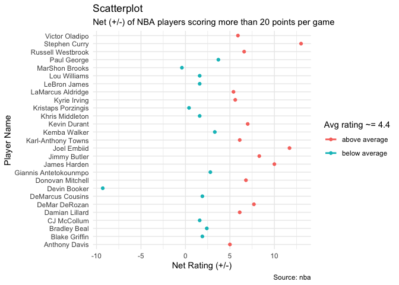
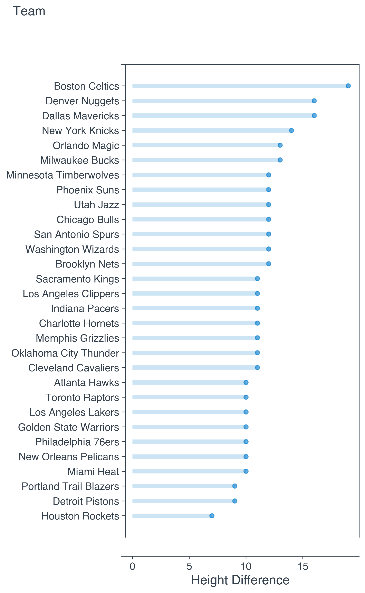

 

# What is Outside the Box?

[Outside the Box](https://www.thejacksanders.com/nba/) is where I keep my NBA-related thoughts.
---
 

## I am eager to include more posts on this blog, but right now you can find some fun content like this:

[At what age to NBA players score the most points?](https://www.thejacksanders.com/nba-age-pts/)

[What NBA players have the best +/- box score?](https://www.thejacksanders.com/nba-age-pts/)

[What NBA teams have the largest height difference between players?](https://www.thejacksanders.com/nba-height-diff/)

# And, you can find more serious content about querying and visualizaing data like this:

<pre>
def display_data():
    master_list = []
    for team in Teams():
        print('=' * 80)
        print(team.name)
        team_heights = {}
        for player in team.roster.players:
            height = get_height_in_inches(player.height)
            team_heights[player.name] = height
        height_diff = print_players(team_heights)
        master_list.append([team.name, height_diff])
    print(master_list)
    return master_list
</pre>

<pre>
theme_set(theme_minimal())
ggplot(s2017, aes(x=net_rating, y=player_name, col = ifelse(net_rating > avg,'above average','below average'))) +
  geom_point() + 
  geom_smooth(method=lm, se=FALSE) +
  theme(legend.position="right") + 
  labs(subtitle="Net (+/-) of NBA players scoring more than 20 points per game", 
       y="Player Name", 
       x="Net Rating (+/-)",
       col="Avg rating ~= 4.4",
       title="Scatterplot", 
       caption = "Source: nba")
</pre>